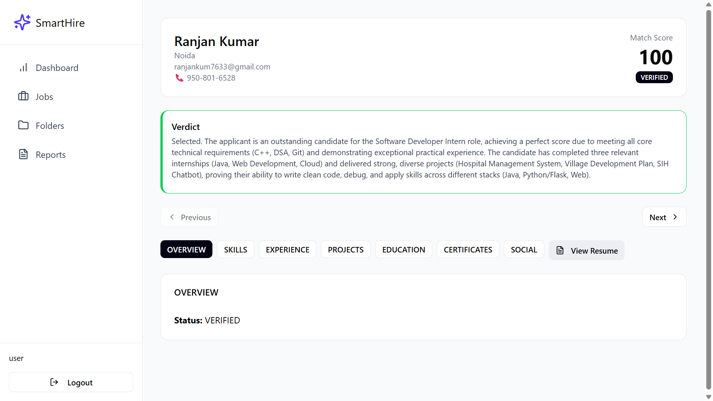
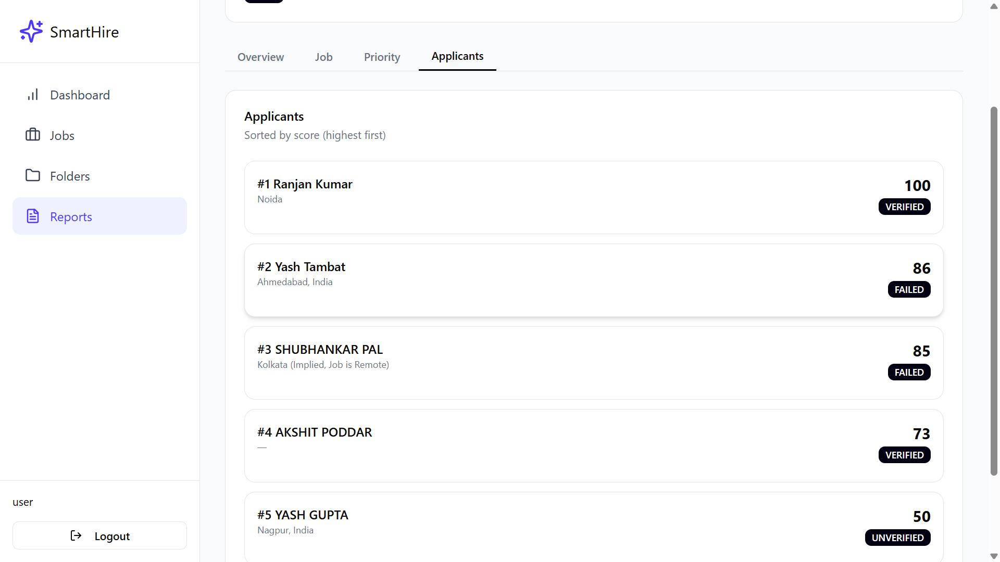
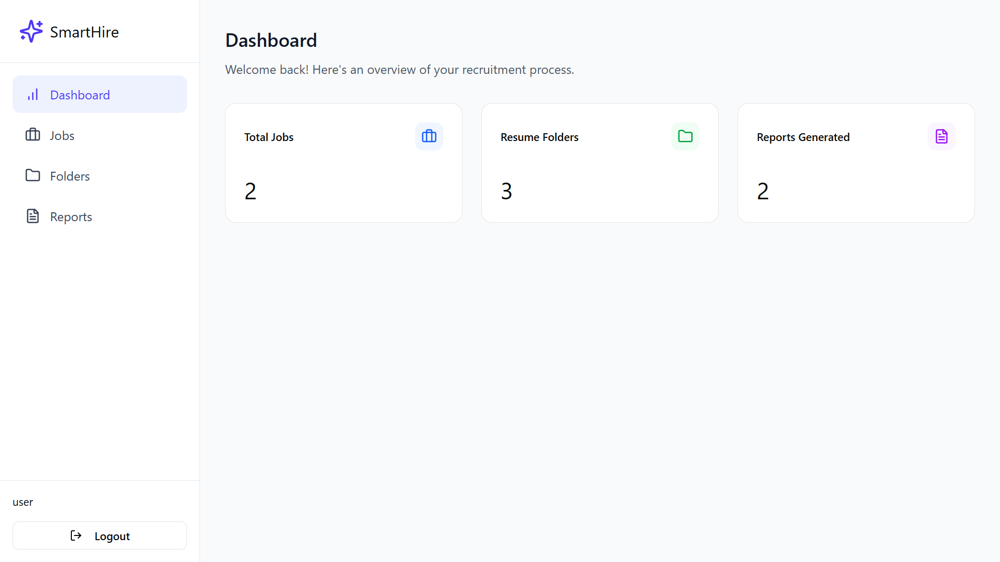
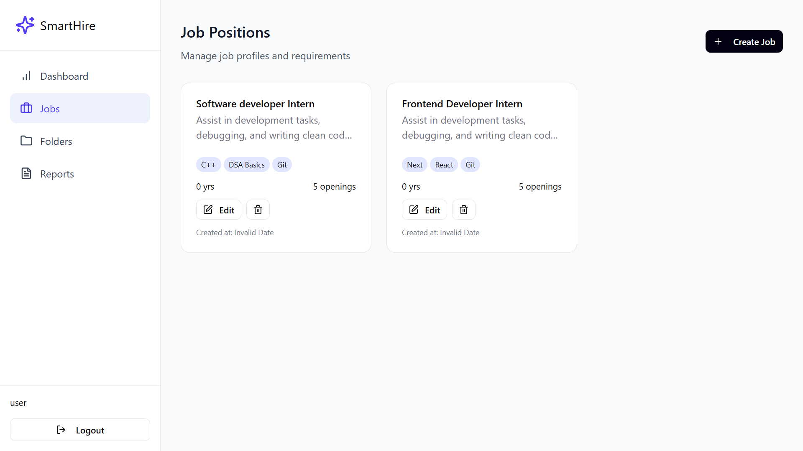
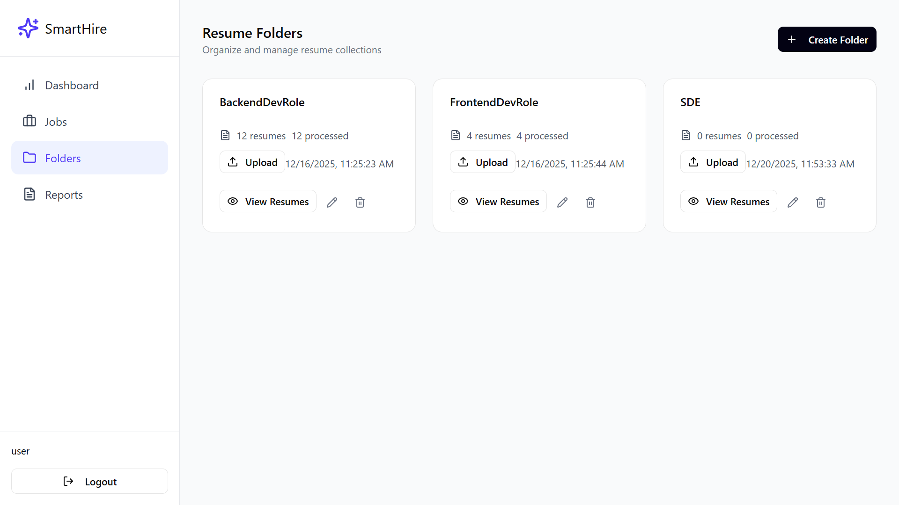
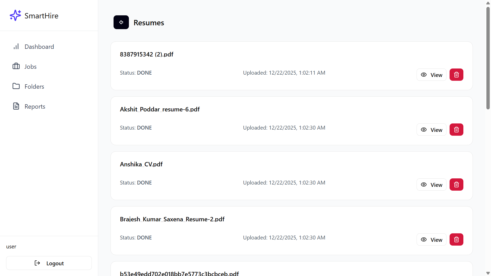

# SmartHire.io – Intelligent Recruitment Operating System

SmartHire.io is a backend-focused recruitment platform that automates the hiring pipeline with asynchronous workers, resume ingestion, AI-driven scoring, and a "Deep Verification" layer that inspects candidates' GitHub and project URLs for quality and security.

Website: https://smarthire-io.onrender.com/  
API Docs: https://documenter.getpostman.com/view/42155936/2sB3dWrmaN

## Key Features

- Smart organization: create Folders for hiring drives and bulk-upload PDF resumes.
- Asynchronous automation: a Worker Loop processes "PENDING" resumes, extracts text/links, uploads to Cloudinary, and updates the DB.
- AI-driven reporting: Job Profiles with weighted priorities that must sum to exactly 100% to compute candidate scores.
- Deep Verification:
  - GitHub Deep Scan: analyze package.json, file extensions, repo contents to verify claimed skills.
  - Project Threat & SEO Analysis: Google Safe Browsing + Cheerio-based scraping for security and responsiveness.

## Tech Stack

- Runtime: Node.js + TypeScript
- Framework: Express.js
- DB: MongoDB (Mongoose)
- Storage: Cloudinary
- Analysis: Cheerio, pdf-parse, pdfjs-dist, Axios
- Security: bcrypt, JWT, Google Safe Browsing API

## Architecture (high level)

1. Auth & setup: user logs in and creates Job Profiles and Resume Folders.
2. Ingestion: PDFs are uploaded and flagged "PENDING".
3. Processing: automation worker extracts text/links, uploads to Cloudinary, and updates records.
4. Matching: Report engine scores candidates against Job Profiles.
5. Verification: social and threat scanners validate GitHub and project URLs.

## Important files / entry points

- Backend entry: [`BACKEND/src/index.ts`](BACKEND/src/index.ts) (`index.ts`)
- Core backend utility: [`BACKEND/src/code.ts`](BACKEND/src/code.ts) (`code.ts`)
- Controllers:
  - [`controllers.automationController`](BACKEND/src/controllers/automationController.ts) ([BACKEND/src/controllers/automationController.ts](BACKEND/src/controllers/automationController.ts))
  - [`controllers.applicantController`](BACKEND/src/controllers/applicantController.ts) ([BACKEND/src/controllers/applicantController.ts](BACKEND/src/controllers/applicantController.ts))
  - [`controllers.authController`](BACKEND/src/controllers/authController.ts) ([BACKEND/src/controllers/authController.ts](BACKEND/src/controllers/authController.ts))
- Frontend (React/Vite): [`SmartResumeTool/src/main.tsx`](SmartResumeTool/src/main.tsx) ([SmartResumeTool/src/main.tsx](SmartResumeTool/src/main.tsx))
- Landing page: [LANDING_PAGE/index.html](LANDING_PAGE/index.html)
- Backend config: [BACKEND/package.json](BACKEND/package.json)
- Frontend config: [SmartResumeTool/package.json](SmartResumeTool/package.json)
- Screenshots / visuals: [assets/](assets/)

## Screenshots

## How to run

- See backend/start scripts in [BACKEND/package.json](BACKEND/package.json).
- See frontend scripts in [SmartResumeTool/package.json](SmartResumeTool/package.json).

## Notes

- Resume ingestion and processing rely on background workers and Cloudinary storage.
- Report engine enforces that profile priority weights sum to 100% before scoring.
- Deep verification uses GitHub scraping and Google Safe Browsing for threat detection.

Screenshots are available in the project assets folder: [assets/](assets/)